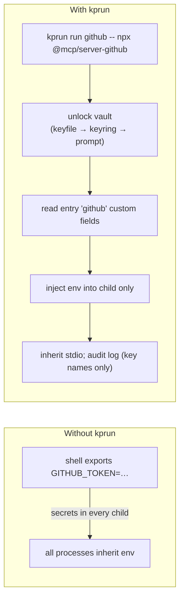

# kprun v0.6.2

[](https://github.com/numikel/kprun/actions/workflows/ci.yml)
[](LICENSE)


**Local secrets injector for developers and AI agent workflows.** KeePass `.kdbx` vault (KeePassXC-compatible), OS keychain unlock, per-process env injection — not session-wide.

[Releases](https://github.com/numikel/kprun/releases) · [Changelog](CHANGELOG.md) · [Install](#installation) · [Quick start](#quick-start) · [Scripts & automation](#scripts-and-automation) · [Coding agents & OpenRouter](#coding-agents-and-openrouter) · [MCP integration](#mcp-integration) · [Security model](#security-model)

---

## About

kprun stores API keys and tokens in a KeePass database on your machine. It unlocks the vault via `KPRUN_KEYFILE`, the OS credential store, or an interactive prompt, then injects secrets as environment variables into **one child process** only. Nothing is exported to your shell profile, nothing lands in MCP stdout.

Typical uses:

- Run MCP servers (`npx …`) without pasting tokens into client config files
- Launch coding agents (Claude Code, Hermes, Junie, AGY, …) with OpenRouter env vars injected for one session only
- Run Python, Node.js, or shell scripts with injected secrets for automation (`kprun run myapi -- python script.py`)
- Skip per-project `.env` files — secrets live in the vault and are injected at run time, not on disk in the repo
- Manage a dedicated **dev-secrets** vault separate from your personal password manager

## How it works



Unlock priority: `KPRUN_KEYFILE` → OS keystore (`kprun` / `master`) → hidden stderr prompt.

## Features

- ✅ **KeePass / KeePassXC vault** — entry title = service name; custom string fields = env var names
- ✅ **Per-process injection** — `kprun run` opens the vault read-only and spawns one child with merged env
- ✅ **MCP-safe stdio** — `run` prints nothing on stdout; child owns stdin/stdout/stderr
- ✅ **Full secret lifecycle** — `init`, `set`, `get`, `unset`, `delete`, `export`, `import`, `doctor`
- ✅ **Audit log** — JSON lines with entry names and injected key names; **never values, never the vault path**
- ✅ **Cross-platform** — Linux, macOS, Windows (PATHEXT-aware spawn, keyring v1)
- ✅ **RTK-style install** — `install.sh` / `install.ps1` with SHA-256 checksum verify
- ✅ **CI matrix** — fmt, clippy, tests on ubuntu/windows/macos; release assets on tag `v*`

## Requirements

- **Rust**: 1.88.0+ (to build from source)
- **OS**: Linux, macOS, or Windows
- **Optional**: [KeePassXC](https://keepassxc.org/) to create or edit `.kdbx` files
- **MCP client**: Cursor, Claude Code, or any tool that spawns a subprocess over stdio

## Installation

### Quick install (Linux / macOS)

```bash
curl -fsSL https://raw.githubusercontent.com/numikel/kprun/refs/heads/main/scripts/install.sh | sh
```

Installs to `~/.local/bin` by default. Override with `KPRUN_INSTALL_DIR`. Skip PATH changes with `KPRUN_NO_MODIFY_PATH=1`.

> Add to PATH manually if needed:
>
> ```bash
> echo 'export PATH="$HOME/.local/bin:$PATH"' >> ~/.bashrc   # or ~/.zshrc
> ```

### Quick install (Windows)

```powershell
irm https://raw.githubusercontent.com/numikel/kprun/refs/heads/main/scripts/install.ps1 | iex
```

Default install dir: `%LOCALAPPDATA%\kprun\bin`. Adds user `Path` unless `KPRUN_NO_MODIFY_PATH=1`.

Open a **new terminal**, then verify:

```bash
kprun --version
```

### Pre-built binaries

Download from [GitHub Releases](https://github.com/numikel/kprun/releases) (after the first tag):

| Platform | Asset |
|----------|-------|
| Linux x86_64 | `kprun-x86_64-unknown-linux-gnu.tar.gz` |
| Linux arm64 | `kprun-aarch64-unknown-linux-gnu.tar.gz` |
| macOS Intel | `kprun-x86_64-apple-darwin.tar.gz` |
| macOS Apple Silicon | `kprun-aarch64-apple-darwin.tar.gz` |
| Windows | `kprun-x86_64-pc-windows-msvc.zip` + standalone `kprun.exe` |

Verify with `checksums.txt` from the same release unless `KPRUN_SKIP_CHECKSUM=1`.

### Build from source

```bash
git clone https://github.com/numikel/kprun.git
cd kprun
cargo build --release -p kprun
# binary: target/release/kprun (or target/<triple>/release/kprun)
```

Or install into Cargo bin dir:

```bash
cargo install --path crates/kprun
```

Or straight from Git, without cloning:

```bash
cargo install --git https://github.com/numikel/kprun
```

## Updating

### From previous v0.4.x

```bash
# Cargo
cargo install --git https://github.com/numikel/kprun --force

# Or re-run install script
curl -fsSL https://raw.githubusercontent.com/numikel/kprun/refs/heads/main/scripts/install.sh | sh
```

**v0.5.0 breaking change**: OS keychain account name changed (lexical path → SHA-256).
On Windows or macOS `/tmp` vaults, re-run `kprun init` after updating to re-store the master password.

### Binary updates

Download latest from [GitHub Releases](https://github.com/numikel/kprun/releases), verify checksum, replace executable.

### Troubleshooting updates

**Windows: "access denied" or "failed to remove file"**

The executable may be locked by an antivirus, file system cache, or running process:

```powershell
# Kill any running kprun process
Get-Process kprun -ErrorAction SilentlyContinue | Stop-Process -Force

# Remove the old binary manually
Remove-Item -Path "$env:USERPROFILE\.cargo\bin\kprun.exe" -Force -ErrorAction SilentlyContinue

# Retry installation
cargo install --git https://github.com/numikel/kprun --force
```

If `cargo clean && cargo install --path crates/kprun` still fails, wait 10–15 seconds (antivirus quarantine) and retry.

## Quick start

```bash
# 1. Create vault — one command, no prompts. A master password is generated,
#    stored in the OS keychain, and shown once on stdout.
kprun init --quick
# ⚠️ SAVE THE MASTER PASSWORD PRINTED ABOVE — you'll need it to open the vault in KeePassXC.
# Retrieve later with: kprun reveal-master

# 2. Store secrets (entry title = service; fields = env vars)
kprun set github GITHUB_TOKEN=ghp_xxx

# 3. Inject into a child process
kprun run github -- npx -y @modelcontextprotocol/server-github
```

Windows (after `install.ps1`):

```powershell
kprun init --quick
# ⚠️ SAVE THE MASTER PASSWORD PRINTED ABOVE (shown once for security)
# Retrieve later with: kprun reveal-master

kprun set github GITHUB_TOKEN=ghp_xxx
kprun run github -- npx -y @modelcontextprotocol/server-github
```

**About the master password**: `kprun init --quick` generates a random password, **prints it once** (save it for KeePassXC access), and stores it securely in the OS keychain. You don't need to memorize it — it's automatically unlocked for `kprun run` and other commands. If you forget it, retrieve it anytime with `kprun reveal-master`.

Prefer choosing your own master password (or a keyfile)? Run plain `kprun init` instead.

### Attach an existing KeePassXC database

```bash
kprun init --db /path/to/existing.kdbx
```

Verifies unlock and optionally stores the master password in the OS keychain. Does **not** recreate the database.

## Scripts and automation

Beyond MCP servers and coding agents, `kprun run` injects vault secrets into **any** child process that reads environment variables — Python, Node.js, shell scripts, and more. Handy for CI jobs, cron, Task Scheduler, and one-off scripts without checking secrets into a repo or exporting them in your shell profile.

### Skip project `.env` files

Many tools expect secrets in a `.env` file (`python-dotenv`, `dotenv` in Node, framework auto-load). With kprun, store keys in the vault instead and launch through `kprun run` — the child sees normal environment variables, with **no `.env` on disk**, nothing to `.gitignore`, and no accidental commits. Scripts can use `os.getenv` / `process.env` as usual; you can drop `load_dotenv()` or `require('dotenv').config()` when env is always injected by kprun.

To move an existing flat `.env` into the vault once, see [Export and import](#export-and-import).

The `--` separator is **required** — it marks where vault entry names end and the child command begins:

```text
kprun run <entry> [entry2 ...] -- <command> [args...]
```

Without `--`, everything after `run` is parsed as entry names and the command is missing (common mistake).

### Python

Store API keys or tokens under one vault entry, then run your script — secrets appear as normal env vars inside the child only:

```bash
kprun set myapi API_KEY=sk-... API_BASE=https://api.example.com
kprun run myapi -- python fetch_data.py
kprun run myapi -- python -m mypackage.cli --dry-run
```

Windows PowerShell:

```powershell
kprun set myapi API_KEY=sk-... API_BASE=https://api.example.com
kprun run myapi -- python fetch_data.py
```

In Python, read them with `os.environ["API_KEY"]` (or `os.getenv`) — no kprun-specific API.

### Node.js / JavaScript

Same pattern for `node`, `npm` scripts, or `npx`:

```bash
kprun set openai OPENAI_API_KEY=sk-...
kprun run openai -- node scripts/sync.js
kprun run openai -- npx tsx scripts/backup.ts
```

Windows PowerShell:

```powershell
kprun run openai -- node scripts/sync.js
```

Combine multiple vault entries when a script needs keys from more than one service:

```bash
kprun run openai langfuse -- python pipeline.py
```

For scheduled jobs without an interactive session (no OS keychain prompt), use a keyfile — see [Automation and cron](#automation-and-cron).

## Coding agents and OpenRouter

Many terminal coding agents read API keys and provider URLs from **environment variables**. Instead of exporting them in `~/.bashrc` or `~/.zshrc` (where every process inherits them), store the OpenRouter profile in your vault and launch the agent through `kprun run`.

The `--` separator is required — it marks where vault entry names end and the child command begins:

```text
kprun run <entry> -- <agent-command> [args...]
```

### One-time vault setup (Claude Code / OpenRouter)

Per [OpenRouter's Claude Code guide](https://openrouter.ai/docs/cookbook/coding-agents/claude-code-integration), Claude Code expects these variables. Store them under one vault entry (title = `openrouter` here; any name works):

```bash
kprun set openrouter \
  OPENROUTER_API_KEY=sk-or-... \
  ANTHROPIC_BASE_URL=https://openrouter.ai/api \
  ANTHROPIC_AUTH_TOKEN=sk-or-... \
  ANTHROPIC_API_KEY=
```

KeePass fields are literal values — set `ANTHROPIC_AUTH_TOKEN` to the same key as `OPENROUTER_API_KEY`. Set `ANTHROPIC_API_KEY` to an **empty** string to avoid auth conflicts with a cached Anthropic login (run `/logout` inside Claude Code once if you previously signed in with Anthropic).

Optional model overrides (also from the OpenRouter docs):

```bash
kprun set openrouter \
  ANTHROPIC_DEFAULT_SONNET_MODEL='~anthropic/claude-sonnet-latest' \
  ANTHROPIC_DEFAULT_OPUS_MODEL='~anthropic/claude-opus-latest'
```

### Launch examples

**Claude Code** — secrets stay in the child process only; your shell profile stays clean:

```bash
kprun run openrouter -- claude
```

Windows PowerShell:

```powershell
kprun run openrouter -- claude
```

Verify inside Claude Code with `/status` (auth token: `ANTHROPIC_AUTH_TOKEN`, base URL: `https://openrouter.ai/api`).

**Antigravity CLI (`agy`)** — the CLI authenticates via Google by default. If you use OpenRouter through a plugin, extension, or any workflow that reads `OPENROUTER_API_KEY` from the environment, inject it the same way:

```bash
kprun set openrouter OPENROUTER_API_KEY=sk-or-...
kprun run openrouter -- agy
```

**Hermes Agent** — Nous Research's terminal agent reads `OPENROUTER_API_KEY` from the environment (alternative to `~/.hermes/.env`). Model and provider stay in `~/.hermes/config.yaml`; see [OpenRouter's Hermes guide](https://openrouter.ai/docs/cookbook/coding-agents/hermes-integration):

```bash
kprun set openrouter OPENROUTER_API_KEY=sk-or-...
kprun run openrouter -- hermes
# or: kprun run openrouter -- hermes --tui
```

**Junie CLI** — JetBrains' terminal agent uses OpenRouter as a native BYOK provider via `JUNIE_OPENROUTER_API_KEY`; see [OpenRouter's Junie guide](https://openrouter.ai/docs/cookbook/coding-agents/junie):

```bash
kprun set openrouter \
  OPENROUTER_API_KEY=sk-or-... \
  JUNIE_OPENROUTER_API_KEY=sk-or-...
kprun run openrouter -- junie
```

Headless CI example (same injected env, no shell profile):

```bash
kprun run openrouter -- junie "Review and fix any code quality issues in the latest commit"
```

**GitHub Copilot CLI** — Copilot fixes the model at startup and speaks OpenAI-compatible APIs; env injection alone is awkward for live model switching. For Copilot CLI (and Codex CLI with OpenRouter), the author recommends **[copilot-cli-custom-proxy](https://github.com/numikel/copilot-cli-custom-proxy)** instead: a local tray proxy that swaps models on the fly, injects the API key from memory, and launches Copilot/Codex with the right env — without putting keys in your shell profile.

| Agent | kprun fit | Notes |
|-------|-----------|-------|
| Claude Code | ✅ Best fit | Env-based OpenRouter setup; see [OpenRouter docs](https://openrouter.ai/docs/cookbook/coding-agents/claude-code-integration) |
| Hermes Agent | ✅ Best fit | `OPENROUTER_API_KEY`; config in `~/.hermes/config.yaml`; see [OpenRouter docs](https://openrouter.ai/docs/cookbook/coding-agents/hermes-integration) |
| Junie CLI | ✅ Best fit | `JUNIE_OPENROUTER_API_KEY`; see [OpenRouter docs](https://openrouter.ai/docs/cookbook/coding-agents/junie) |
| Antigravity CLI (`agy`) | ⚠️ Partial | Default auth is Google; use kprun when the workflow reads env vars |
| Copilot CLI / Codex CLI | ❌ Use proxy | Prefer [copilot-cli-custom-proxy](https://github.com/numikel/copilot-cli-custom-proxy) |

One OpenRouter key can power every tool above; generate it at [openrouter.ai/settings/keys](https://openrouter.ai/settings/keys).

## Configuration

| Variable | Default | Description |
|----------|---------|-------------|
| `KPRUN_DB` | `~/.kprun/secrets.kdbx` | Path to the KeePass database |
| `KPRUN_KEYFILE` | — | Path to a cryptographic key file (second factor) |
| `KPRUN_LOG` | `~/.kprun/access.log` | Audit log path (JSON lines; see [Audit log format](#audit-log-format)) |
| `KPRUN_INSTALL_DIR` | `~/.local/bin` / `%LOCALAPPDATA%\kprun\bin` | Install script target |
| `KPRUN_NO_MODIFY_PATH` | unset | Set to `1` to skip shell PATH updates |
| `KPRUN_SKIP_CHECKSUM` | unset | Set to `1` to skip install checksum verify |
| `KPRUN_VERSION` | latest release | Pin install script version |
| `KPRUN_TEST_MASTER` | — | Test hook (only in builds compiled with `--features test-hooks`; not present in GitHub Release binaries): fixed master password for automation |

Install script env vars are documented in `scripts/install.sh` and `scripts/install.ps1`.

## CLI reference

```
kprun init   [--db PATH] [--no-store] [--keyfile PATH] [--quick [--force]]
kprun run    <entry> [entry2 ...] -- <command> [args...]
kprun list   [--json]
kprun get    <entry> [--keys] [--reveal]
kprun set    <entry> KEY=val [KEY2=val2 ...] | --stdin
kprun unset  <entry> KEY [KEY2 ...]
kprun delete <entry>
kprun export [--format json|dotenv] [--stdout] [--reveal] [--output PATH]
kprun import <file> [--merge]
kprun migrate <file> [--entry <name>] [--merge] [--gitignore] [--delete]
kprun scan   [--path DIR] [--history [--full-history]] [--json]
kprun doctor [--mcp <entry>] [-- <command>...]
kprun mcp    -e <entry> [--header "Name: template"]... [--bearer FIELD] [--transport auto|streamable-http|sse] [--timeout SECS] [--allow-insecure-http] <url>
kprun reveal-master [--db PATH]
kprun deinit [--db PATH] [--delete-vault [--yes]]
```

For detailed workflow examples, see [Export and import](#export-and-import), [MCP integration](#mcp-integration), and [Automation and cron](#automation-and-cron) below.

---

## CLI Functions

### `kprun init`

**Purpose**: Create a new KeePass vault or attach an existing one. The vault stores secrets in a `.kdbx` file and the master password can be stored in the OS keychain for automatic unlocking.

**Syntax**:
```
kprun init [--db PATH] [--no-store] [--keyfile PATH] [--quick [--force]]
```

**Options**:
- `--db PATH` — Path to the KeePass database (default: `~/.kprun/secrets.kdbx` or `KPRUN_DB` env var). If the path points to an existing database, kprun verifies unlock and optionally stores the master password in the keychain.
- `--keyfile PATH` — Path to a cryptographic key file (256 random bits encoded as hex). Created if missing. Acts as a second factor alongside the master password; both are required to unlock. Useful for automation when the OS keychain is unavailable (cron, Task Scheduler).
- `--no-store` — Do not store the master password in the OS keychain. Requires interactive prompts on every `kprun` command. Incompatible with `kprun mcp` (which cannot prompt).
- `--quick` — Non-interactive setup: generates a random 128-bit master password (printed once to stdout), creates a password-only vault (no keyfile required), and stores the password in the OS keychain. **Save the printed password** — you will need it to open the vault in KeePassXC. Incompatible with `--keyfile` and `--no-store`.
- `--force` — Requires `--quick`. Overwrites an existing vault after confirmation; does not ask interactively, assumes `yes`.

**Limitations**:
- The vault file is stored as plaintext on disk (encrypted inside the `.kdbx` format). If the vault is compromised, all secrets are at risk.
- Empty custom-field values cannot be stored — the KDBX backend drops them on save.
- After updating from v0.4.x to v0.5.0+, the keychain account name changed (lexical path → SHA-256). Re-run `kprun init --quick` on temporary vaults to update the keychain entry.

**Examples**:
```bash
# Quick setup: auto-generated password, stored in keychain
kprun init --quick
# ⚠️ SAVE THE MASTER PASSWORD PRINTED ABOVE

# Custom database path with keyfile
kprun init --db /vault/secrets.kdbx --keyfile /vault/master.key

# Attach an existing KeePassXC database
kprun init --db ~/Documents/MyPasswords.kdbx

# Re-initialize vault (overwrites after confirmation)
kprun init --quick --force
```

---

### `kprun run`

**Purpose**: Inject secrets from vault entries into a child process environment. The child process inherits only the injected variables plus a safe default environment (PATH, HOME, etc.). Nothing is exported to your shell profile.

**Syntax**:
```
kprun run [--clean-env] <entry> [entry2 ...] -- <command> [args...]
```

**Arguments**:
- `<entry> [entry2 ...]` — One or more vault entry titles. Secrets from all entries are merged into the child's environment. If an entry doesn't exist, `kprun` exits with error code `1`.
- `--` — Required separator that marks where entry names end and the child command begins.
- `<command> [args...]` — Command to run in the child process. Receives the injected environment variables.

**Options**:
- `--clean-env` — Inject vault secrets into a minimal, safe environment instead of inheriting parent env. Drops parent variables except PATH, HOME, and a small allowlist. Useful for scripts that should not see unrelated secrets from the parent shell.

**Limitations**:
- The child process exits with the same exit code as the command (non-zero signals are reported as 128 + signal number on Unix).
- Duplicate entry names are silently deduplicated.
- If multiple entries define the same key, the last entry's value wins (collision handling follows POSIX env-var precedent).
- The `--` separator is **mandatory** — without it, every positional argument is parsed as an entry name and the command is never found.

**Examples**:
```bash
# Run Python with injected secrets from 'myapi' entry
kprun run myapi -- python script.py

# Multiple entries: secrets from both are merged
kprun run openai langfuse -- python pipeline.py

# NPX with injected GitHub token
kprun run github -- npx -y @modelcontextprotocol/server-github

# Run with minimal environment (drops parent env)
kprun run api --clean-env -- node server.js
```

---

### `kprun list`

**Purpose**: Display all vault entries and their custom field names (key names), but not values.

**Syntax**:
```
kprun list [--json]
```

**Options**:
- `--json` — Output as a single JSON array of objects, each with `entry` (entry title) and `keys` (array of field names). Suitable for scripting and CI pipelines.

**Limitations**:
- Does not show secret values (use `kprun get --reveal` for values on a single entry).
- Exit code `1` if the vault cannot be opened (missing DB, unlock failed).

**Examples**:
```bash
# Human-readable list
kprun list
# Output:
# github
#   GITHUB_TOKEN
#   GITHUB_URL
# openai
#   OPENAI_API_KEY

# JSON format for scripting
kprun list --json
# Output: [{"entry":"github","keys":["GITHUB_TOKEN","GITHUB_URL"]},...]

# Filter entries with jq (requires --json)
kprun list --json | jq -r '.[].entry'
```

---

### `kprun get`

**Purpose**: Show custom fields (key names and optionally values) for a single vault entry.

**Syntax**:
```
kprun get <entry> [--keys] [--reveal]
```

**Arguments**:
- `<entry>` — Vault entry title to read.

**Options**:
- `--keys` — Print only field names, one per line (default behavior includes both names and placeholder values).
- `--reveal` — Print full KEY=value lines with secret values. **Triggers a stderr warning and audit log record** — use deliberately. Audit log will record that the value was revealed but never the actual value.

**Limitations**:
- Entry title lookup is case-insensitive, but duplicates (if they exist) cause an error.
- Exit code `1` if the entry is not found or the vault cannot be opened.
- Values are never printed by default — only key names and placeholder `[secret]` text.

**Examples**:
```bash
# Show key names only
kprun get github
# Output:
# GITHUB_TOKEN=[secret]
# GITHUB_URL=[secret]

# Show only the names
kprun get github --keys
# Output:
# GITHUB_TOKEN
# GITHUB_URL

# Reveal actual values (audit logged)
kprun get github --reveal
# Output (+ stderr warning):
# GITHUB_TOKEN=ghp_xxx...
# GITHUB_URL=https://github.com
```

---

### `kprun set`

**Purpose**: Create a new vault entry or update secret fields on an existing entry.

**Syntax**:
```
kprun set <entry> KEY=val [KEY2=val2 ...] | --stdin
```

**Arguments**:
- `<entry>` — Vault entry title. Created if it doesn't exist.
- `KEY=val [KEY2=val2 ...]` — One or more `KEY=value` pairs to set. Values are parsed as literal strings (no shell expansion).

**Options**:
- `--stdin` — Read `KEY=value` lines from stdin instead of argv. Blank lines and `#` comment lines are skipped. **Avoids exposing secrets in shell history or process listings.** Incompatible with positional arguments.

**Limitations**:
- Empty or whitespace-only values are silently dropped by the KDBX backend and cannot be stored.
- Inline `kprun set` commands expose secrets to shell history and `ps` output during execution — prefer `--stdin` for sensitive values.
- Exit code `1` if the vault cannot be opened or unlocked.

**Examples**:
```bash
# Set a single key on an existing entry (risky: shows in shell history)
kprun set github GITHUB_TOKEN=ghp_xxx

# Set multiple keys at once
kprun set openai OPENAI_API_KEY=sk-... OPENAI_ORG_ID=org-...

# Use stdin to avoid shell history (secure)
kprun set github --stdin <<'EOF'
GITHUB_TOKEN=ghp_xxx
GITHUB_URL=https://github.com
EOF

# Or pipe from a file
cat secrets.txt | kprun set myapi --stdin
```

---

### `kprun unset`

**Purpose**: Remove custom fields (secret keys) from a vault entry without deleting the entry itself.

**Syntax**:
```
kprun unset <entry> KEY [KEY2 ...]
```

**Arguments**:
- `<entry>` — Vault entry title.
- `KEY [KEY2 ...]` — One or more field names to remove.

**Limitations**:
- If a key doesn't exist on the entry, it is silently ignored (no error).
- Exit code `1` if the entry is not found or the vault cannot be opened.
- Does not delete the entry — to remove the entire entry, use `kprun delete`.

**Examples**:
```bash
# Remove a single key
kprun unset github GITHUB_TOKEN

# Remove multiple keys
kprun unset openai OPENAI_API_KEY OPENAI_ORG_ID

# Entry still exists after unset
kprun get github  # succeeds, but entry has fewer fields
```

---

### `kprun delete`

**Purpose**: Completely remove a vault entry and all its custom fields.

**Syntax**:
```
kprun delete <entry>
```

**Arguments**:
- `<entry>` — Vault entry title to delete.

**Limitations**:
- No confirmation prompt (delete is final).
- Exit code `1` if the entry is not found or the vault cannot be opened.

**Examples**:
```bash
# Permanently delete an entry
kprun delete old-api

# Entry is now gone
kprun get old-api  # exits with error "Entry not found"
```

---

### `kprun export`

**Purpose**: Export vault entries to JSON or dotenv format for backup, migration, or sharing vault structure. **See [Export and import](#export-and-import) section below for workflow details, format examples, and round-trip procedures.**

**Syntax**:
```
kprun export [--format json|dotenv] [--stdout] [--reveal] [--output PATH]
```

**Options**:
- `--format json|dotenv` — Output format: `json` (default, structured) or `dotenv` (kprun dotenv round-trip).
- `--stdout` — Write to stdout instead of a file (suitable for piping).
- `--reveal` — Include secret values in the export (**unencrypted on disk** — use carefully, audit logged).
- `--output PATH` — Write to this file instead of the default `kprun-export.json` or `.env`.

**Limitations**:
- By default, key **names** only are exported (values shown as `[secret]`). Use `--reveal` to export actual values.
- Exit code `1` if the vault cannot be opened or the output file cannot be written.

**Quick examples**:
```bash
kprun export --format json --stdout           # JSON to stdout
kprun export --reveal --output /tmp/backup    # Values to file (unsafe)
kprun export --format dotenv --stdout         # Dotenv format
```

---

### `kprun import`

**Purpose**: Import vault entries from JSON or dotenv files. By default replaces all vault content; use `--merge` to add or update without deleting. **See [Export and import](#export-and-import) section below for accepted formats and workflow examples.**

**Syntax**:
```
kprun import <file> [--merge]
```

**Options**:
- `--merge` — Add or update imported entries; keep others in vault. Without this, entire vault is replaced.

**Limitations**:
- Generic project `.env` files (no `# entry` headers) cannot be imported — use `kprun migrate` instead.
- Structure-only exports (no values) are rejected to prevent accidental wipes.
- Exit code `1` if the file cannot be read or is malformed.

**Quick examples**:
```bash
kprun import backup.json                  # Replace vault
kprun import new-entries.json --merge     # Add to existing vault
```

---

### `kprun migrate`

**Purpose**: Migrate a standard project `.env` file (flat KEY=value format) into the vault. Automatically names the entry after the file's directory, handles `.gitignore` setup, and can delete the source file after import.

**Syntax**:
```
kprun migrate <file> [--entry <name>] [--merge] [--gitignore] [--delete]
```

**Arguments**:
- `<file>` — Path to a standard `.env` file (e.g., `.env`, `config/.env`, `backend/.env`).

**Options**:
- `--entry <name>` — Vault entry title for the imported secrets (default: name of the directory containing the file, e.g., `.env` → `root`, `backend/.env` → `backend`).
- `--merge` — Add keys to an existing entry instead of creating a new one.
- `--gitignore` — Automatically add the file's name to `.gitignore` without prompting (useful for CI).
- `--delete` — Delete the source `.env` file after successful import. **Only deletes if the file was successfully imported and re-read for byte-identity verification**.

**Limitations**:
- Only accepts standard `.env` format (no `#` entry headers). For kprun dotenv format, use `kprun import`.
- Empty or whitespace-only values are skipped with a stderr warning.
- Exit code `1` if the file cannot be read or parsed.
- The source file is kept unless `--delete` is passed.

**Examples**:
```bash
# Migrate and ask about .gitignore
kprun migrate backend/.env

# Migrate and automatically handle .gitignore, then delete the file
kprun migrate backend/.env --gitignore --delete

# Migrate to a custom entry name
kprun migrate .env --entry prod-secrets --merge

# CI-friendly: minimal interaction, full cleanup
kprun migrate app/.env --entry app --gitignore --delete
```

---

### `kprun doctor`

**Purpose**: Diagnose vault configuration and generate a ready-to-paste MCP server config snippet for `mcp.json`.

**Syntax**:
```
kprun doctor [--mcp <entry> [-- <command>...]]
```

**Options**:
- `--mcp <entry>` — Print a JSON MCP config snippet for this vault entry instead of diagnostics. Suitable for pasting into `mcp.json`.
- `-- <command>...` — MCP server command to append (e.g., `-- npx -y @modelcontextprotocol/server-github`). Without this, the snippet is incomplete and hints at manual completion.

**Output**:
- Without `--mcp`: Summary of vault location, unlock method, and configuration issues (if any).
- With `--mcp <entry>`: A ready-to-paste JSON object for `mcpServers` (Linux/macOS use symlink, Windows use full path).

**Limitations**:
- If `--mcp` is used without a command, the output is incomplete (only `["run", "<entry>", "--"]`); you must manually add the server command.
- Exit code `1` if the vault cannot be opened or the entry is not found.

**Examples**:
```bash
# Diagnose configuration
kprun doctor

# Generate MCP snippet for GitHub
kprun doctor --mcp github -- npx -y @modelcontextprotocol/server-github

# Output:
# {
#   "command": "kprun",
#   "args": ["run", "github", "--", "npx", "-y", "@modelcontextprotocol/server-github"]
# }

# Copy to your mcp.json:
# "mcpServers": {
#   "github": { ... snippet ... }
# }
```

---

### `kprun mcp`

**Purpose**: Bridge stdio JSON-RPC messages to a remote HTTP MCP server, injecting vault-backed auth headers. Enables secure, non-interactive access to hosted MCP servers (GitHub Copilot, Context7, etc.) without storing credentials in `mcp.json`. **See [MCP integration](#mcp-integration) section below for detailed setup, transport modes, and authentication patterns.**

**Syntax**:
```
kprun mcp -e <entry> [--header "Name: template"]... [--bearer FIELD] \
  [--transport auto|streamable-http|sse] [--timeout SECS] \
  [--allow-insecure-http] <url>
```

**Arguments & Options**:
- `-e, --entry <entry>` — Vault entry whose custom fields fill `{{FIELD}}` templates.
- `<url>` — Remote MCP endpoint URL (supports `{{FIELD}}` substitution).
- `--header "Name: template"` — Extra HTTP header (repeatable), with `{{FIELD}}` substitution.
- `--bearer FIELD` — Shorthand for `Authorization: Bearer {{FIELD}}`.
- `--transport auto|streamable-http|sse` — Transport mode (`auto` default, tries Streamable HTTP then legacy SSE fallback).
- `--timeout SECS` — Per-request timeout (default 30).
- `--allow-insecure-http` — Allow vault-backed credentials over plaintext `http://` to non-loopback hosts.

**Limitations**:
- Cannot prompt for password — requires OS keychain or `KPRUN_KEYFILE`.
- Audit log records entry names and host only, **never credential values**.
- One audit line written at bridge startup; repeated MCP calls do not add more lines.

**Quick examples**:
```bash
kprun mcp -e github --bearer TOKEN https://api.githubcopilot.com/mcp/
kprun mcp -e context7 --header "CONTEXT7_API_KEY: {{CONTEXT7_API_KEY}}" https://mcp.context7.com/mcp
```

---

### `kprun reveal-master`

**Purpose**: Print the stored master password for the current vault to stdout. Useful for opening the vault in KeePassXC or for emergency recovery.

**Syntax**:
```
kprun reveal-master [--db PATH]
```

**Options**:
- `--db PATH` — Path to the KeePass database (default: `KPRUN_DB` or `~/.kprun/secrets.kdbx`).

**Limitations**:
- Triggers a **stderr warning** and **audit log record** — use deliberately.
- Exit code `1` if the password cannot be retrieved from the keychain or if the database is not found.
- Requires the master password to be stored in the OS keychain (set at `kprun init` or re-stored with `kprun init --db <path>`). If `--no-store` was used, the password is not available.

**Examples**:
```bash
# Print master password to stdout (with stderr warning)
kprun reveal-master

# Copy to clipboard (macOS)
kprun reveal-master | pbcopy

# Copy to clipboard (Linux with xclip)
kprun reveal-master | xclip -selection clipboard

# Copy to clipboard (Windows PowerShell)
kprun reveal-master | Set-Clipboard
```

---

### `kprun deinit`

**Purpose**: Remove the stored master password from the OS keychain, and optionally delete the vault file itself. Useful for cleanup or switching to a different vault.

**Syntax**:
```
kprun deinit [--db PATH] [--delete-vault [--yes]]
```

**Options**:
- `--db PATH` — Path to the KeePass database (default: `KPRUN_DB` or `~/.kprun/secrets.kdbx`).
- `--delete-vault` — Also delete the vault file (`.kdbx`). Asks for confirmation unless `--yes` is passed.
- `--yes` — Requires `--delete-vault`. Skip confirmation prompt and immediately delete the vault file.

**Limitations**:
- Only removes the keychain entry and vault file — does **not** touch the keyfile (if one exists) or audit log.
- Exit code `1` if the database is not found or the keychain entry cannot be removed.
- This is a destructive operation and cannot be undone; `--yes` skips the safety prompt.

**Examples**:
```bash
# Remove stored password (vault file is kept)
kprun deinit

# Remove stored password and delete the vault file (with confirmation)
kprun deinit --delete-vault

# Remove password and vault, skip confirmation (CI-friendly)
kprun deinit --delete-vault --yes
```

---

### `kprun scan`

**Purpose**: Fast heuristic scan for accidentally committed secrets in git-tracked files and history. Detects well-known API key formats (AWS, GitHub, OpenAI, Stripe, etc.). **Not a substitute for dedicated scanners like gitleaks or trufflehog.**

**Syntax**:
```
kprun scan [--path DIR] [--history [--full-history]] [--json]
```

**Options**:
- `--path DIR` — Directory to scan (default: current directory). Must be inside a git repository.
- `--history` — Additionally scan git history (`git log -p`, last 500 commits by default).
- `--full-history` — Requires `--history`. Remove the 500-commit limit and scan entire history.
- `--json` — Output a single JSON document suitable for CI pipelines. Findings are masked (e.g., `ghp_x7Kq…(40 chars)`).

**Detected formats**:
- AWS access key IDs (`AKIA…`)
- GitHub tokens (`ghp_…` family, `github_pat_…`)
- OpenAI project keys (`sk-proj-…`)
- Anthropic keys (`sk-ant-…`)
- Stripe keys (`sk_live_…`, `sk_test_…`)
- Google API keys (`AIza…`)
- Slack tokens (`xoxb-…` family)
- GitLab PATs (`glpat-…`)
- Private key blocks (`-----BEGIN … PRIVATE KEY-----`)

**Known limitations**:
- Legacy OpenAI `sk-…` keys (bare prefix) are **not detected** — too ambiguous to match with high confidence.
- `.env.example`, `.env.sample`, `.env.template`, `.env.dist` are scanned for content but not flagged as files (they are templates).
- Findings are **masked** (`ghp_x7Kq…(40 chars)`) — full secret values never appear in output.

**Exit codes**:
- `0` — No findings.
- `1` — Findings detected.
- `2` — Execution error (git missing, `--path` outside repository).

**Examples**:
```bash
# Scan current directory working tree only
kprun scan

# Scan and include git history (last 500 commits)
kprun scan --history

# Scan entire history
kprun scan --history --full-history

# Scan a subdirectory
kprun scan --path backend

# JSON output for CI pipelines
kprun scan --json | jq '.findings'

# Exit code check for CI gates
kprun scan --history --json && echo "✓ Clean" || echo "✗ Findings detected"
```

### Export and import

`import` accepts JSON (`.json`) or kprun dotenv (`.env`). JSON is the structured format from `kprun export --stdout`. Dotenv is **not** a generic project `.env` file — it is the round-trip format produced by `kprun export --format dotenv`.

Each vault **entry** is a comment line with the entry title, followed by `KEY=value` lines. Separate entries with a blank line:

```env
# github
GITHUB_TOKEN="ghp_xxx"

# postgres
DATABASE_URL="postgres://local"
```

To migrate a flat project `.env` (keys only, no title comments), use `kprun migrate` — it parses the standard format directly, names the entry after the file's directory, and can clean up the repository:

```bash
kprun migrate backend/.env                       # asks before touching .gitignore
kprun migrate backend/.env --gitignore --delete  # CI-friendly, full cleanup
kprun migrate .env --entry backend --merge       # explicit title, add to existing entry
```

For the kprun dotenv round-trip format itself:

```bash
kprun import secrets.env --merge   # add/update keys; keep other vault entries
kprun import secrets.env           # replace vault content with file entries
```

Inspect the canonical dotenv layout with:

```bash
kprun export --format dotenv --stdout --reveal
```

Structure-only dotenv exports (key names in `#` comments, no values) cannot be imported — re-export with `--reveal` first.

## MCP integration

MCP clients spawn a command and talk over the child's stdio. Use `kprun run` as a transparent wrapper.

**Linux / macOS** (with `kprun` on `PATH`):

```json
{
  "mcpServers": {
    "github": {
      "command": "kprun",
      "args": ["run", "github", "--", "npx", "-y", "@modelcontextprotocol/server-github"]
    }
  }
}
```

**Windows** (prefer full path — some MCP clients do not resolve `PATH` reliably):

```json
{
  "mcpServers": {
    "github": {
      "command": "C:\\Users\\you\\AppData\\Local\\kprun\\bin\\kprun.exe",
      "args": ["run", "github", "--", "npx", "-y", "@modelcontextprotocol/server-github"]
    }
  }
}
```

Generate a ready-to-paste fragment:

```bash
kprun doctor --mcp github
```

For other entries, append the MCP server command after `--`:

```bash
kprun doctor --mcp qdrant -- npx -y @modelcontextprotocol/server-qdrant
```

Without a child command, generic entries emit `["run", "<entry>", "--"]` and a stderr hint — paste the server command into `args` manually or re-run with `--`.

After editing MCP config, check `git diff` — some tools may write secrets back to disk.

### kprun mcp — hosted MCP servers

Hosted MCP servers (GitHub Copilot, remote SaaS endpoints, …) don't spawn a local child process — the client talks HTTP directly to a URL, so the bearer token or API key normally sits in plaintext inside `mcp.json`. `kprun mcp` closes that gap: it's a stdio↔HTTP bridge that reads the token from the vault at launch and never writes it to disk.

```bash
kprun mcp -e <entry> [--header "Name: template"]... [--bearer FIELD] \
  [--transport auto|streamable-http|sse] [--timeout SECS] \
  [--allow-insecure-http] <url>
```

- `-e, --entry <ENTRY>` — vault entry whose custom fields fill `{{FIELD}}` templates in headers and the URL
- `--header "Name: template"` — extra header, repeatable, with `{{FIELD}}` substitution
- `--bearer FIELD` — shorthand for `--header "Authorization: Bearer {{FIELD}}"`
- `--transport` — `auto` (default, follows the MCP spec's backwards-compatibility detection: try Streamable HTTP, fall back to the deprecated HTTP+SSE only when the server answers `initialize` with `404`/`405`), `streamable-http`, or `sse` (deprecated HTTP+SSE only). Known limitation: the legacy HTTP+SSE path is validated against mock servers only — providers have retired the live endpoints (e.g. DeepWiki's `/sse` now returns `410 Gone`) — and the legacy stream has no auto-reconnect. Using it prints a deprecation warning on stderr; prefer Streamable HTTP URLs.
- `--timeout SECS` — per-request timeout for POST round-trips (default 30; SSE streams are exempt — they're long-lived by design)
- `--allow-insecure-http` — kprun refuses to send vault-backed credentials (`--bearer`, any `--header`, or a `{{FIELD}}` in the URL) over plaintext `http://` to a non-loopback host, because they would be readable by any network observer. `http://` to loopback (`127.0.0.0/8`, `::1`, `localhost`) is always allowed for local dev servers. This flag deliberately overrides the refusal for a trusted network path — prefer `https://`.

Client config:

```jsonc
"GitHub": {
  "command": "kprun",
  "args": ["mcp", "-e", "github", "--bearer", "TOKEN",
           "https://api.githubcopilot.com/mcp/"]
}
```

Providers that use a custom header (not `Authorization: Bearer`) need `--header` instead of `--bearer`. [Context7](https://context7.com) is a common case — the native client config puts the API key in plaintext:

```jsonc
"context7": {
  "url": "https://mcp.context7.com/mcp",
  "headers": { "CONTEXT7_API_KEY": "YOUR_API_KEY" }
}
```

Store the key in the vault (`kprun set context7 CONTEXT7_API_KEY=ctx7sk-...`, or `--stdin` to avoid shell history), then bridge with:

```jsonc
"context7": {
  "command": "kprun",
  "args": ["mcp", "-e", "context7",
           "--header", "CONTEXT7_API_KEY: {{CONTEXT7_API_KEY}}",
           "https://mcp.context7.com/mcp"]
}
```

The `{{CONTEXT7_API_KEY}}` placeholder must match a custom field on the `context7` vault entry (`kprun get context7` lists field names). Starting the bridge writes [one audit line](#audit-log-format) (`entries: ["context7"]`, `injected_keys: ["CONTEXT7_API_KEY"]`, `command: "mcp mcp.context7.com"`) — not one line per tool call.

`kprun mcp` never prompts — it needs a non-interactive unlock path. Run `kprun init` first so the master password is cached in the OS keyring, or set `KPRUN_KEYFILE` (see [Automation and cron](#automation-and-cron)). Note the keyfile is a *second* key component, not a password replacement: for a vault protected by password + keyfile, the password must be in the keyring (do not use `--no-store` at `init`), otherwise non-interactive unlock fails with `Incorrect key`. Like `run`, it writes nothing but JSON-RPC frames to stdout; the audit log gets **one line when the bridge starts** (header names and URL host only, never token values) — not on each MCP tool call in that session.

Auth troubleshooting: a missing token yields a clear `HTTP 401` error, and some servers (e.g. GitHub Copilot MCP) answer an *invalid* token with `HTTP 400` — both now fail fast with a credentials hint and never retry over legacy SSE. Automatic fallback to the deprecated HTTP+SSE transport happens only when the server answers `initialize` with `404`/`405` (the MCP spec's signature of a pre-Streamable server); for an unusual legacy server that responds otherwise, pass `--transport sse` explicitly.

## Automation and cron

When no interactive session is available (cron, Task Scheduler), the OS keychain may be unavailable. Use a **keyfile**:

```bash
kprun init --keyfile ~/.kprun/master.key
export KPRUN_KEYFILE=~/.kprun/master.key
kprun run myservice -- python /path/to/job.py
# or: kprun run myservice -- node /path/to/job.js
# or: kprun run myservice -- /path/to/script.sh
```

Windows Task Scheduler — set `KPRUN_KEYFILE` and `KPRUN_DB` in the task environment, then:

```powershell
kprun run myservice -- python C:\jobs\nightly.py
```

The keyfile is generated by kprun (64 random bytes), not a plaintext password file. Restrict permissions (`chmod 600` on Unix; user-only ACL on Windows).

For scheduled jobs, set `KPRUN_DB` and `KPRUN_KEYFILE` in the job environment. Use `--no-store` at `init` if you do not want the master password in the keychain — but note this breaks `kprun mcp`, which cannot prompt: with `--no-store` the password exists nowhere non-interactive, and the keyfile alone cannot open a password+keyfile vault.

## Project structure

```
kprun/
├── crates/
│   ├── kprun-core/          # vault, unlock, inject, audit (no clap / Command)
│   └── kprun/               # CLI binary, spawn, commands
├── scripts/
│   ├── install.sh           # RTK-style installer (Unix)
│   └── install.ps1          # Windows installer
├── tests/                   # integration tests (run, init, manage, export, doctor, …)
├── .github/workflows/
│   ├── ci.yml               # fmt, clippy, test matrix
│   └── release.yml          # cross-build + checksums on tag v*
└── docs/
    ├── kprun.gif            # demo animation
    └── changelogs/          # per-version release notes
```

## Development

### Setup

```bash
git clone https://github.com/numikel/kprun.git
cd kprun
cargo build -p kprun
```

### Running tests

```bash
cargo test --all-features
```

KeePassXC compatibility test (optional, local fixture):

```bash
# Create tests/fixtures/keepassxc.kdbx in KeePassXC (gitignored)
# Entry title: fixture; custom attribute: FIXTURE_KEY
KPRUN_KEEPASSXC_FIXTURE=1 KPRUN_TEST_MASTER='your-pass' \
  cargo test reads_keepassxc_fixture -- --ignored
```

### Code quality (matches CI)

```bash
cargo fmt --all -- --check
cargo clippy --all-targets --all-features -- -D warnings
cargo test --all-features
```

## Security model

- Use a dedicated **dev-secrets** vault, not your personal password manager.
- Report vulnerabilities per [SECURITY.md](SECURITY.md) (**contact@michalsk.pl**); do not file public issues for security bugs.
- Secrets exist in the **child process environment** after injection (same model as other secret runners).
- Audit log records entry names, injected key names, and a non-identifying vault id — **never values, never the vault path** (see [Audit log format](#audit-log-format)).
- Do not use `setx` or global shell profiles for API keys.
- Pass only the entries a command needs: `kprun run openai -- python script.py`, not every secret at once.
- `export --reveal` and `get --reveal` print values to the terminal — use deliberately.
- `kprun reveal-master` joins the `--reveal` family: it prints the vault master password to stdout with a stderr warning and an audit record (`db_id` only, never the value) — use deliberately.
- Inline `kprun set <entry> KEY=value` puts the secret in your **shell history** and in **process listings** (`ps`, Task Manager) while the command runs. For sensitive values prefer `kprun set <entry> --stdin` and type or pipe `KEY=value` lines (blank lines and `#` comments are skipped):

  ```bash
  kprun set github --stdin <<'EOF'
  GITHUB_TOKEN=ghp_xxx
  EOF
  ```

### Secret scanning (`kprun scan`)

`kprun scan` is a **fast, high-confidence heuristic**: prefix-anchored
matching for well-known key formats over all git-tracked files, plus
detection of tracked `.env` files (`.env.example` / `.env.sample` /
`.env.template` / `.env.dist` count as templates — not flagged as files,
but their content is still scanned). With `--history` it also scans lines
added in `git log -p` (last 500 commits; `--full-history` removes the
limit). Both the working-tree and `--history` scans are scoped to `--path`;
history covers commits reachable from `HEAD` (not unmerged branches,
stashes, or commits reachable only from other refs).

- It is **not** a substitute for a dedicated scanner — run
  [gitleaks](https://github.com/gitleaks/gitleaks) or
  [trufflehog](https://github.com/trufflesecurity/trufflehog) for a full
  audit.
- Detected: AWS access key IDs (`AKIA…`), GitHub tokens (`ghp_…` family
  and `github_pat_…`), OpenAI project keys (`sk-proj-…`), Anthropic keys
  (`sk-ant-…`), Stripe keys (`sk_live_…` / `sk_test_…`), Google API keys
  (`AIza…`), Slack tokens (`xoxb-…` family), GitLab PATs (`glpat-…`), and
  private-key blocks (`-----BEGIN … PRIVATE KEY-----`).
- Knowingly undetected: legacy OpenAI `sk-…` keys — the bare `sk-` prefix
  is too ambiguous to match with high confidence.
- Findings are always **masked** (`ghp_x7Kq…(40 chars)`): the full secret
  value never appears in scan output, `--json` included.
- `--json` prints a single machine-readable document (`"version": 1`)
  with findings and scan stats for CI consumption.

### Audit log format

Every audit record is one JSON line with exactly these fields:

| Field | Contents |
|-------|----------|
| `ts` | Local timestamp, `%Y-%m-%dT%H:%M:%S%z` |
| `pid` | Process id of the kprun invocation |
| `db_id` | Non-identifying vault id: first 16 hex chars of the SHA-256 of the canonicalized db path (same digest the OS keyring account uses). The raw path — which would embed your OS username — is never logged. |
| `entries` | Vault entry titles accessed |
| `injected_keys` | Env var / header **names** injected (never values) |
| `command` | Child command name (`run`), `mcp <host>` (URL host only), or `null` |

**When is a line written?** One line per kprun process that reads secrets from the vault — not per downstream operation inside that process. For `kprun run`, that is once when the child is spawned. For `kprun mcp`, that is once when the MCP client starts the bridge; every JSON-RPC frame (including repeated tool calls) reuses the same process and does **not** append further lines. A new line appears only when the client restarts the MCP server (reload config, IDE restart, reconnect). Individual MCP method names, request counts, and RPC payloads are never logged.

Examples — `run` (one line per spawned child):

```json
{"ts":"2026-07-08T14:03:11+0100","pid":4242,"db_id":"9f2b4c1a8e3d5f07","entries":["openai"],"injected_keys":["OPENAI_API_KEY"],"command":"python"}
```

`mcp` (one line when Cursor starts the bridge; four Context7 tool calls in the same session still produce this single line):

```json
{"ts":"2026-07-10T23:00:00+0200","pid":12345,"db_id":"9f2b4c1a8e3d5f07","entries":["context7"],"injected_keys":["CONTEXT7_API_KEY"],"command":"mcp mcp.context7.com"}
```

Prior to v0.3.2 the record carried a `db` field with the full vault path; lines written by older versions are left untouched — rotate or delete old logs if that matters to you.

Entry titles are written **verbatim** to the unencrypted audit log on each such vault read and are retained until rotation pushes them out (two files, ~10 MB).
Choose service-oriented, non-identifying titles (`github`, `openai`,
`staging-db`) rather than names of people or clients.

## Releases

Releases are published when a maintainer tags `vX.Y.Z` and pushes:

```bash
git tag vX.Y.Z
git push origin main --tags
```

CI validates the changelog file and version match, builds release binaries for five targets, and publishes a GitHub Release whose body comes from [docs/changelogs/vX.Y.Z.md](docs/changelogs/).

## Contributing

1. Fork the repository.
2. Create a feature branch (`git checkout -b feat/my-change`).
3. Commit using **Conventional Commits 1.0.0** (e.g. `feat(cli): add example command`, `fix(core): handle locked db`).
4. Add or update tests for behavior changes.
5. Run `cargo fmt`, `cargo clippy --all-targets --all-features -- -D warnings`, and `cargo test --all-features`.
6. Open a pull request against `main`.

Use English for code, comments, and CLI messages.

## License

MIT License — see [LICENSE](LICENSE).

## Author

**@numikel**

---

**Security note:** kprun injects secrets into child process environments. Treat the vault file, keyfile, and audit log as sensitive. Do not commit `.kdbx` files or keyfiles to version control.
