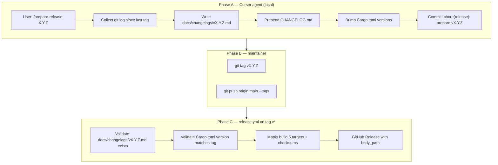

# CI/CD release, changelog, and repo hygiene — design spec

**Date:** 2026-06-23  
**Status:** Approved (brainstorming)  
**Scope:** Release pipeline with IDE-generated changelog, GitHub Release publishing, full repo configuration

## Summary

Extend kprun with a two-phase release workflow: a **Cursor agent skill** prepares version bumps and changelog files locally; pushing a `v*` tag triggers **CI** to validate, cross-build binaries, and publish a GitHub Release whose body comes from a per-version markdown file. Complement this with standard open-source repo files (license, security policy, Dependabot, templates, CODEOWNERS, CoC) and CI hardening (`cargo audit`).

## Goals

| Goal | How |
|------|-----|
| Repeatable releases | Documented skill + validated CI on tag push |
| Human-readable changelog | Agent writes Keep a Changelog markdown from Conventional Commits |
| Tag ↔ changelog consistency | Tag always points at commit that includes changelog files |
| Per-version release notes | `docs/changelogs/vX.Y.Z.md` used as GitHub Release body |
| Cumulative history | Root `CHANGELOG.md` prepended each release |
| Repo hygiene | LICENSE, SECURITY, Dependabot, templates, CODEOWNERS, CoC |
| Supply-chain checks | `cargo audit` in CI, Dependabot for Cargo + Actions |

## Non-goals

- LLM calls inside GitHub Actions (changelog generation is IDE-only)
- Fully automated semver from commits (maintainer chooses version and tag)
- Public repo migration (repo may stay private; files are standard either way)
- MSI/deb packaging changes
- Branch protection as code (documented manual GitHub UI setup)

## Decisions (locked)

| Topic | Decision |
|-------|----------|
| Release trigger | Manual `git tag vX.Y.Z && git push --tags` |
| Changelog generation | Cursor coding agent via `prepare-release` skill (local IDE) |
| Changelog locations | `CHANGELOG.md` (root) + `docs/changelogs/vX.Y.Z.md` (per release) |
| Release body source | `docs/changelogs/vX.Y.Z.md` via `body_path` in `softprops/action-gh-release` |
| Security contact | contact@michalsk.pl |
| Repo hygiene scope | Full package: LICENSE, SECURITY, Dependabot, issue/PR templates, CODEOWNERS, CoC, setup docs, cargo audit |

## Architecture

### Release flow



### Component boundaries

| Component | Responsibility | Depends on |
|-----------|----------------|------------|
| `prepare-release` skill | Changelog writing, version bump, commit | git, repo history, Conventional Commits |
| `release.yml` | Validate, build, publish | Pre-existing changelog commit at tag |
| `ci.yml` | Quality gates + audit | Rust toolchain 1.88.0 |
| Repo hygiene files | Policy, templates, automation config | GitHub features |

## Phase A: `prepare-release` skill

**Location:** `.cursor/skills/prepare-release/SKILL.md`

**Invocation:** User runs `/prepare-release X.Y.Z` (semver without `v` prefix).

### Agent checklist (mandatory order)

1. **Resolve range** — `git describe --tags --abbrev=0` for previous tag; if none, use first commit. Collect `git log` and diff stats for `(prev..HEAD]`.
2. **Classify commits** — Group by Conventional Commits type: `feat`, `fix`, `perf`, `refactor`, `docs`, `ci`, `build`, `chore`, and detect `BREAKING CHANGE` / `feat!` / `fix!`.
3. **Write per-version file** — Create `docs/changelogs/vX.Y.Z.md`:
   - Format: [Keep a Changelog 1.1.0](https://keepachangelog.com/en/1.1.0/)
   - Language: **English** (matches code and README)
   - Sections (omit empty): `Added`, `Changed`, `Deprecated`, `Removed`, `Fixed`, `Security`
   - User-facing bullets; no raw SHAs in bullets (optional “Full commit list” footer)
4. **Update root changelog** — Prepend to `CHANGELOG.md`:

   ```markdown
   ## [X.Y.Z] - YYYY-MM-DD

   See [docs/changelogs/vX.Y.Z.md](docs/changelogs/vX.Y.Z.md) for details.

   ### Added
   - ...
   ```

   For v1+, root file may contain a short summary; full detail stays in per-version file.

5. **Version bump** — Update `[workspace.package].version` in root `Cargo.toml` and `version` in `crates/kprun/Cargo.toml`, `crates/kprun-core/Cargo.toml`.
6. **Self-check** — Confirm: file exists, no `TBD`/`TODO`, semver consistent across manifests, date is today (UTC or local — pick UTC in skill).
7. **Commit** — Single commit: `chore(release): prepare vX.Y.Z`

### First release bootstrap (`v0.1.0`)

When no prior tag exists, agent generates `docs/changelogs/v0.1.0.md` from full history since project start and seeds `CHANGELOG.md` with `[0.1.0]` entry. Maintainer then tags `v0.1.0` on that commit.

### Maintainer steps after skill

```bash
git tag vX.Y.Z
git push origin main --tags
```

## Phase C: `release.yml` changes

Extend existing workflow (trigger unchanged: `push.tags: v*`).

### New job: `validate` (runs before or as first step of `release` job)

```yaml
# Pseudocode — implementation detail for plan
- name: Parse version from tag
  run: echo "VERSION=${GITHUB_REF#refs/tags/v}" >> $GITHUB_ENV

- name: Require per-version changelog
  run: test -f "docs/changelogs/v${VERSION}.md"

- name: Require version match
  run: |
    cargo_version=$(grep '^version' Cargo.toml | head -1 | sed 's/.*"\(.*\)".*/\1/')
    test "$cargo_version" = "$VERSION"
```

### `softprops/action-gh-release` update

```yaml
with:
  body_path: docs/changelogs/v${{ env.VERSION }}.md
  generate_release_notes: false
  files: release/*
```

Existing build matrix (5 targets), packaging, and `checksums.txt` remain unchanged.

## CI extensions (`ci.yml`)

### New job: `audit`

- Install `cargo-audit` (cached via `Swatinem/rust-cache` optional enhancement)
- Run `cargo audit`
- Fails on vulnerabilities with advisory (standard RustSec behavior)

### Optional job: `release-prep-check` (PRs to `main`)

If `Cargo.toml` workspace version changes in PR diff, require matching `docs/changelogs/v*.md` in the same PR. Prevents version bump without changelog when using prepare skill on a branch.

## Repo hygiene files

### `LICENSE`

- MIT License
- Copyright holder: Michał Sk (@numikel)
- Year: 2026 (or range 2025–2026 if project started earlier)

### `SECURITY.md`

- Supported versions table (latest release only for MVP)
- Report vulnerabilities to **contact@michalsk.pl**
- Encourage GitHub Private Security Advisories for repo `numikel/kprun`
- Expected response window (e.g. acknowledge within 7 days)
- Out of scope: social engineering, physical attacks

### `.github/dependabot.yml`

```yaml
version: 2
updates:
  - package-ecosystem: cargo
    directory: /
    schedule:
      interval: weekly
    open-pull-requests-limit: 5
  - package-ecosystem: github-actions
    directory: /
    schedule:
      interval: weekly
```

### Issue templates

- `.github/ISSUE_TEMPLATE/bug_report.yml` — form: version, OS, steps, expected/actual
- `.github/ISSUE_TEMPLATE/feature_request.yml` — form: problem, proposed solution, alternatives
- `.github/ISSUE_TEMPLATE/config.yml` — disable blank issues optional; link to SECURITY.md for security issues

### `.github/pull_request_template.md`

Checklist:

- [ ] Tests added/updated if behavior changed
- [ ] `cargo fmt`, `clippy`, `test` pass locally
- [ ] Conventional Commits message
- [ ] User-facing changes noted (changelog at release time via prepare skill)

### `.github/CODEOWNERS`

```
* @numikel
```

### `CODE_OF_CONDUCT.md`

- Contributor Covenant 2.1
- Enforcement contact: contact@michalsk.pl

### `docs/github-setup.md`

Manual steps for repo owner:

1. Set license to MIT in GitHub repo settings (matches `LICENSE` file)
2. Enable Dependabot alerts and security updates
3. Branch protection on `main`: require CI status checks (`test`, `audit`), no force push
4. Optional: require PR reviews (solo maintainer may skip)

### `docs/changelogs/` directory

- Add `docs/changelogs/.gitkeep` or first `v0.1.0.md` when bootstrapping
- Per-version files are **tracked in git** (not gitignored)

### README updates

- Link to `CHANGELOG.md`
- Security section links to `SECURITY.md`
- Release section documents prepare skill + tag workflow (brief)

## Error handling

| Scenario | Behavior |
|----------|----------|
| Tag pushed without `docs/changelogs/vX.Y.Z.md` | `release.yml` fails with clear error |
| `Cargo.toml` version ≠ tag | Validate step fails before build |
| Duplicate tag | GitHub rejects; no workflow change |
| Empty commit range | Agent asks user to confirm before writing empty changelog |
| `cargo audit` finds CVE | CI fails; Dependabot may open fix PR separately |
| Agent leaves placeholders | Self-check in skill; maintainer review before tag |

## Git ignore note

Root `.gitignore` currently ignores `docs/`. Implementation must **un-ignore** tracked paths:

```
docs/
!docs/changelogs/
!docs/changelogs/**
!docs/github-setup.md
!docs/superpowers/
!docs/superpowers/**
```

Alternatively move `github-setup.md` to repo root. Plan should pick one approach and apply consistently so changelog files and specs are committed.

## Testing strategy

| Area | Verification |
|------|--------------|
| Skill | Dry-run `/prepare-release 0.1.0` on branch; inspect generated markdown |
| `release.yml` validate | Push tag without changelog → expect fail |
| `release.yml` happy path | Tag on commit with changelog → release assets + body |
| `cargo audit` | Run locally and in CI |
| Templates | Open “New issue” / “New PR” on GitHub UI smoke check |
| LICENSE | `cargo package --list` includes LICENSE if required |

## File inventory (new/changed)

| Path | Action |
|------|--------|
| `.cursor/skills/prepare-release/SKILL.md` | Create |
| `CHANGELOG.md` | Create (bootstrap with v0.1.0) |
| `docs/changelogs/v0.1.0.md` | Create (bootstrap) |
| `docs/changelogs/.gitkeep` | Create if no bootstrap yet |
| `docs/github-setup.md` | Create |
| `LICENSE` | Create |
| `SECURITY.md` | Create |
| `CODE_OF_CONDUCT.md` | Create |
| `.github/dependabot.yml` | Create |
| `.github/CODEOWNERS` | Create |
| `.github/ISSUE_TEMPLATE/*.yml` | Create |
| `.github/pull_request_template.md` | Create |
| `.github/workflows/release.yml` | Modify |
| `.github/workflows/ci.yml` | Modify |
| `.gitignore` | Modify (un-ignore changelog paths) |
| `README.md` | Modify (links, release workflow) |

## Success criteria

- Maintainer can run prepare skill, tag, and get a GitHub Release with correct markdown body and binary assets
- `CHANGELOG.md` and `docs/changelogs/vX.Y.Z.md` exist and stay in sync with tag
- CI includes `cargo audit`; Dependabot opens weekly update PRs
- All hygiene files present; SECURITY contact is contact@michalsk.pl
- No LLM invocation in GitHub Actions workflows
